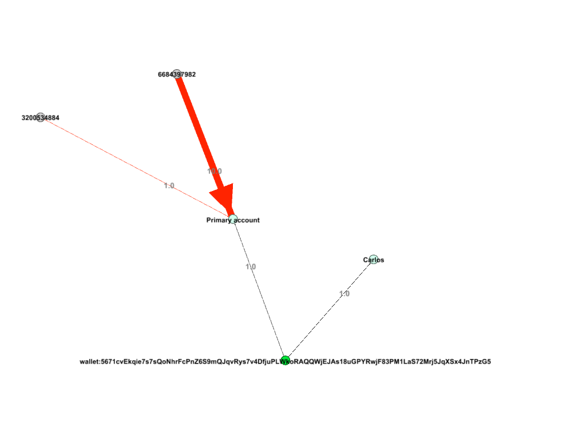
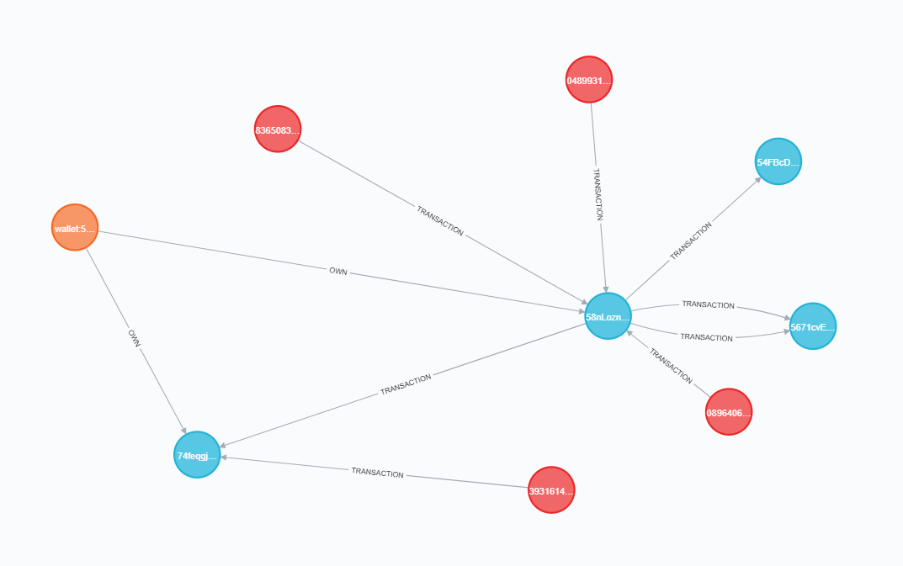

# Solidify
Cryptocurrency Forensics


We use the word solidify as opposed to the term used to denominate the property that grants anonymity to monero: the fungibility.


## Install

We encourage to use `virtualenv`:

```
pip install -r requeriments.txt
```

## Launch

```
usage: solidify.py [-h] [-f WALLET_FILE] [-x X] [-a HOST] [-p PORT]
                   [-nh NEOHOST] [-np NEOPORT] [-nU NEOUSER] [-nP NEOPASSWORD]
                   [-o OUTPUT]

Solidify

optional arguments:
  -h, --help            show this help message and exit
  -f WALLET_FILE, --wallet-file WALLET_FILE
                        Path to wallet file
  -x X, --client-executable X
                        Path to RPC client
  -a HOST, --client-host HOST
                        Running RPC client host
  -p PORT, --client-port PORT
                        Running RPC client port
  -nh NEOHOST, --neoHost NEOHOST
                        Neo4j host
  -np NEOPORT, --neoPort NEOPORT
                        Neo4j Port
  -nU NEOUSER, --neoUser NEOUSER
                        Neo4j User
  -nP NEOPASSWORD, --neoPassword NEOPASSWORD
                        Neo4j Password
  -o OUTPUT, --output OUTPUT
                        Output filename
```

### How does it work

1. Use monero-rpc to load the wallet

```
monero-wallet-rpc.exe --stagenet --password "admin" --rpc-bind-port 28088 --disable-rpc-login  --daemon-host monero-stagenet.exan.tech:38081  --wallet-file C:\Users\username\Documents\Monero\wallets\wallet/wallet
```
2. Use solidify to extract information

```
# For Gephi format
python solidify.py -a localhost -p 28088 -o monero.graphml

# For neo4j integration
python solidify.py -a localhost -p 28088 -nh localhost -np 7687 -nU neo4j -nP 1204
```

3. Visualize

Using [Gephi](https://gephi.org/) and the `.graphml` file:



Or with [neo4j](https://neo4j.com/):


